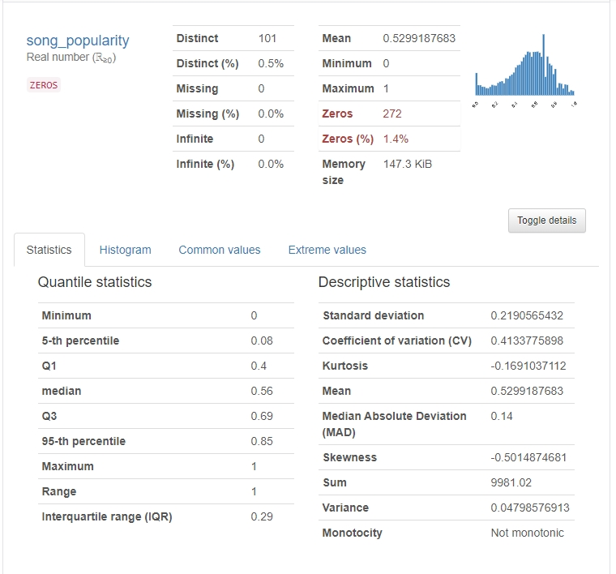
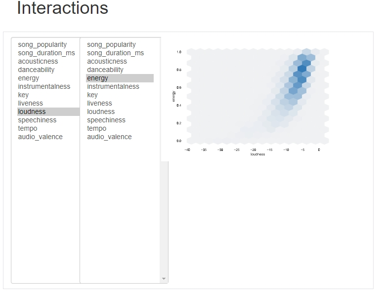
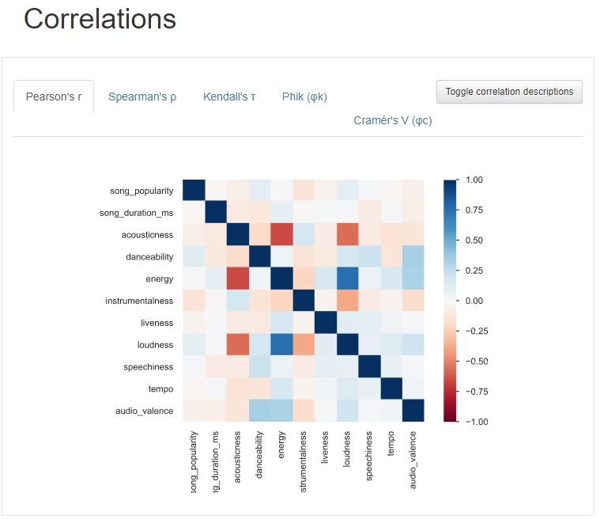

# EDA of the Kaggle dataset "19,000 Spotify Songs"

 ***
 
**The rendering of Jupyter notebooks doesn't work well with html inside notebooks, and pandas-profil output its reports in html.  
Nbviewer, however, works fine:  
https://nbviewer.jupyter.org/github/fauconnier-n/EDA-Spotify-19000-songs/blob/master/EDA_19000_songs.ipynb**

In this notebook we will explore the "19,000 Spotify Songs" dataset available on [Kaggle](https://www.kaggle.com/edalrami/19000-spotify-songs).
It is mostly an excuse to try **[pandas-profiling](https://pandas-profiling.github.io/pandas-profiling/docs/)** on a dataset of a few thousands observations, and carry on the EDA after that. **Pandas-profiling is a library that generates (and export) html EDA reports automatically**. 

**What it looks like:**

